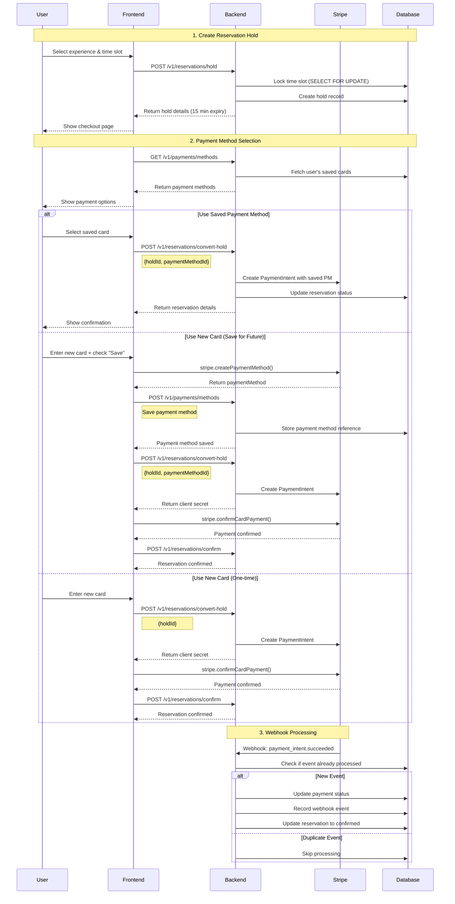
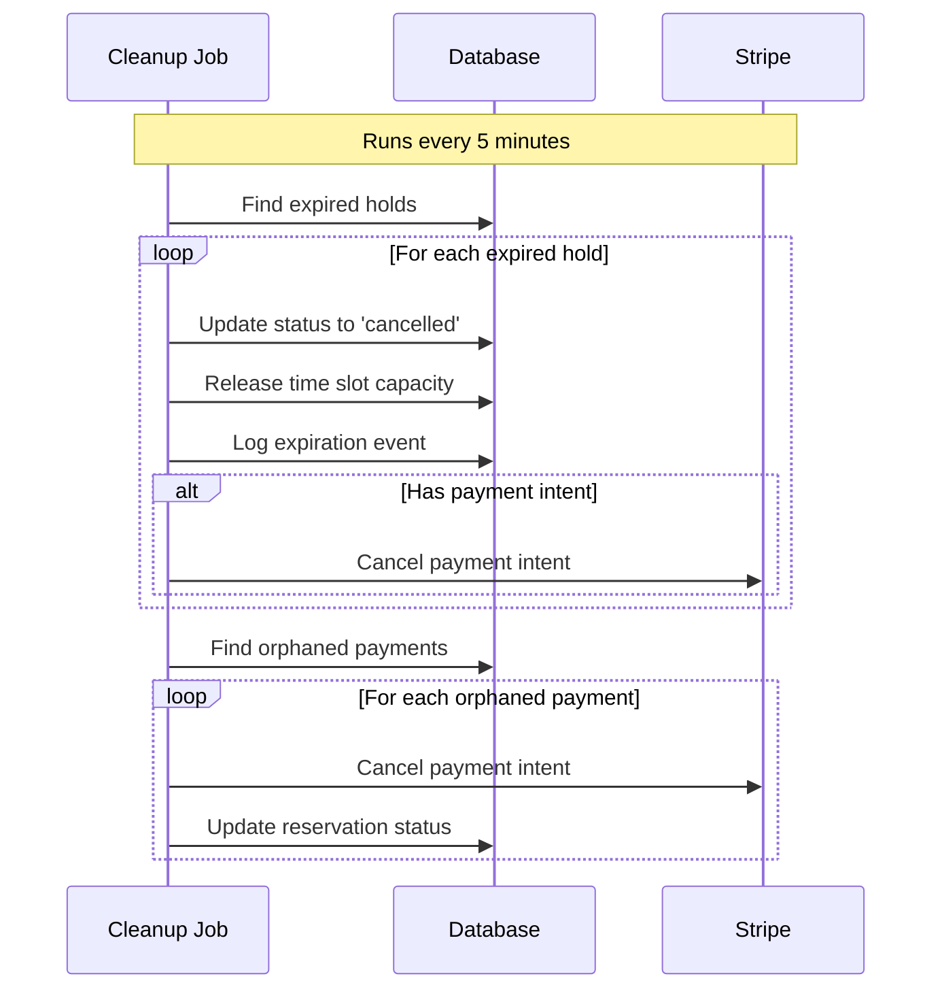
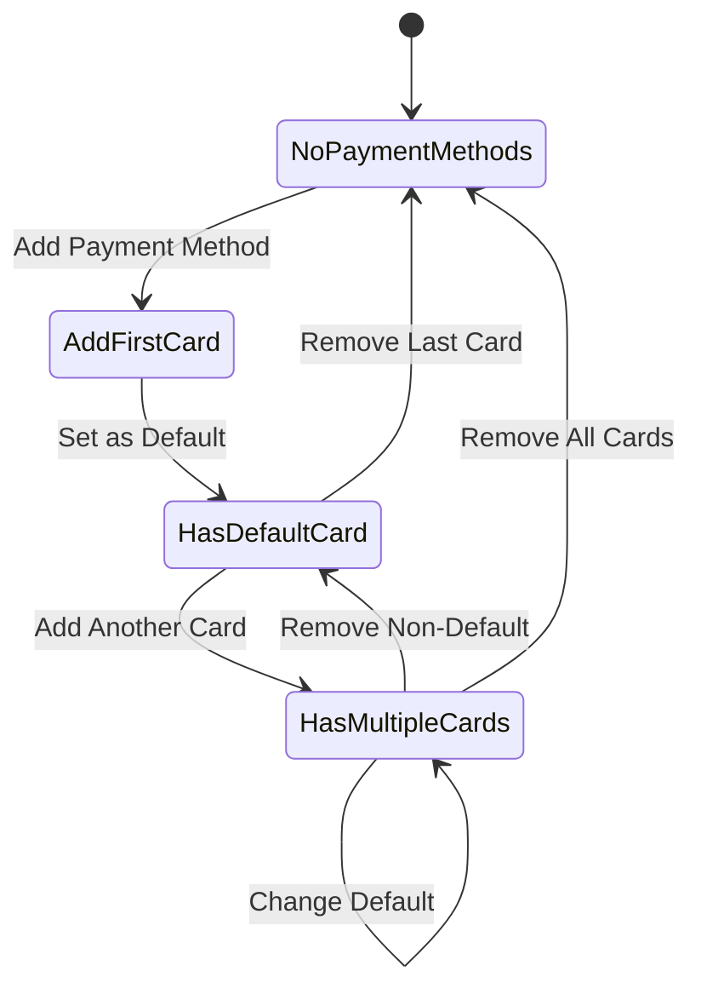
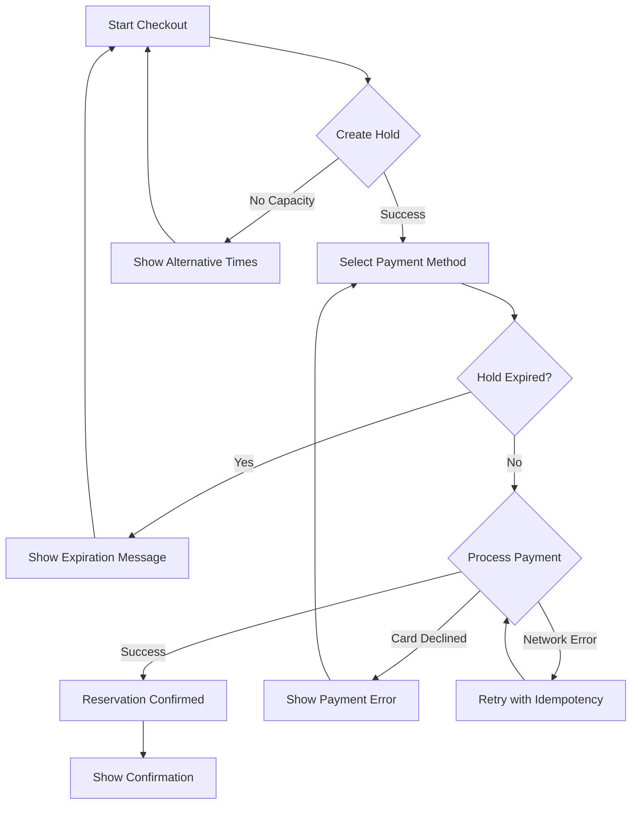
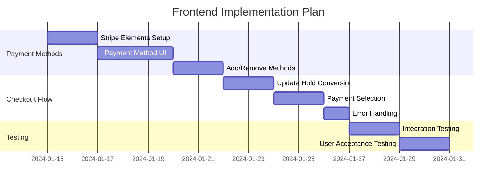

# Reservation Flow Diagram

## Complete Reservation Flow with Payment Methods



## Hold Expiration Flow



## Payment Method Management Flow



## Error Handling States



## Implementation Timeline



## Key Implementation Points

1. **Idempotency**: Always use unique keys for hold creation
2. **Hold Timer**: Display countdown (15 minutes)
3. **Optimistic UI**: Update UI before server confirmation
4. **Error Recovery**: Handle expired holds gracefully
5. **Webhook Backup**: Don't rely solely on frontend confirmation

## State Management Example

```javascript
// Redux/Zustand store structure
const reservationStore = {
  hold: {
    id: 'hold_123',
    expiresAt: '2024-01-15T10:45:00Z',
    experienceId: 'exp_456',
    timeSlotId: 'slot_789',
    totalPrice: 200
  },
  paymentMethods: [
    {
      id: 'pm_method_123',
      last4: '4242',
      brand: 'visa',
      isDefault: true
    }
  ],
  checkout: {
    selectedPaymentMethod: 'pm_method_123',
    saveNewCard: false,
    processing: false,
    error: null
  }
}
```